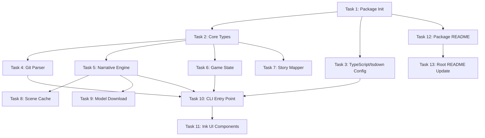

# Git Gaiden Project - Complete Task Breakdown

## Task Dependencies & Order

---

## Task 1: Initialize git-gaiden package structure and configuration

**Priority:** High  
**Labels:** infrastructure, setup  
**Status:** To Do

### Description

Create the base package directory structure under `packages/git-gaiden` with all necessary folders, initial package.json with dependencies (meow, ink, react, simple-git, transformers.js), and essential configuration files (.gitignore, .npmignore, bin setup).

### Implementation Plan

1. Create `packages/git-gaiden/` directory
2. Initialize package.json with name "git-gaiden", version "0.1.0", type "module"
3. Add dependencies: meow (^13.2.0), ink (^5.0.1), react (^18.3.1), @inkjs/ui (^2.0.0), simple-git (^3.27.0)
4. Add devDependencies: typescript (^5.7.0), tsdown (^0.3.0), @types/node, @types/react
5. Create folder structure: src/{cli,git,narrative,game,config}
6. Add bin field pointing to dist/cli.js
7. Add build/dev scripts using tsdown
8. Create .gitignore and .npmignore

### Acceptance Criteria

- [ ] Package directory exists at `packages/git-gaiden`
- [ ] package.json has correct name, version, and all dependencies
- [ ] Folder structure matches architecture (cli, git, narrative, game, config)
- [ ] bin field configured for `gaiden` command
- [ ] npm install works without errors from root

### Notes

- Use latest stable versions of all dependencies
- Package name is "git-gaiden", CLI command is "gaiden"
- Ensure workspace configuration in root package.json includes this package

---

## Task 2: Create core types and domain models

**Priority:** High  
**Labels:** types, core  
**Status:** To Do  
**Dependencies:** Task 1

### Description

Define all TypeScript interfaces and types for the domain model: Commit, Scene, Choice, GameState, BranchInfo, CommitGraph. These types form the contract between all modules and must be comprehensive and well-documented with JSDoc.

### Implementation Plan

1. Create `src/git/types.ts` with:
    - `Commit` interface (hash, shortHash, message, author, date, parents, files, stats)
    - `CommitGraph` interface (commits array, branches, merges, reverts)
    - `BranchInfo` interface
2. Create `src/narrative/types.ts` with:
    - `Scene` interface (id, sceneText, choices array)
    - `Choice` interface (id, label, type enum, nextCommitHash optional)
    - `ChoiceType` enum ('safe' | 'risky' | 'meta')
3. Create `src/game/types.ts` with:
    - `GameState` interface (currentCommit, visitedCommits, progress, branchPath)
    - `StoryNode` interface for graph representation
4. Add comprehensive JSDoc comments to all types
5. Export all types from each module

### Acceptance Criteria

- [ ] All domain types defined with correct structure
- [ ] Types are exported and importable from their modules
- [ ] JSDoc comments document purpose and field meanings
- [ ] No TypeScript errors when importing types
- [ ] Enums defined for fixed value sets (ChoiceType)
- [ ] Optional fields correctly marked with `?`

### Notes

- Keep types pure data structures (no methods)
- Use strict typing (no `any`)
- Consider using `readonly` for immutable fields where appropriate

---

## Task 3: Set up TypeScript and tsdown build configuration

**Priority:** High  
**Labels:** infrastructure, build  
**Status:** To Do  
**Dependencies:** Task 1

### Description

Configure TypeScript compiler options and tsdown bundler for ESM output, proper type generation, and CLI executable. Ensure the build produces a single optimized bundle with type definitions and correct bin configuration for npm.

### Implementation Plan

1. Create `tsconfig.json` in package root:
    - target: ES2022
    - module: ESNext
    - moduleResolution: bundler
    - strict: true
    - esModuleInterop: true
    - skipLibCheck: true
    - outDir: dist
    - declaration: true
2. Create `tsdown.config.ts`:
    - entry: src/cli/index.ts
    - format: esm
    - outDir: dist
    - target: node18
    - shims: true (for **dirname, **filename)
    - banner: #!/usr/bin/env node
3. Add scripts to package.json:
    - "build": "tsdown"
    - "dev": "tsdown --watch"
    - "typecheck": "tsc --noEmit"
4. Ensure dist/cli.js is executable and has shebang

### Acceptance Criteria

- [ ] tsconfig.json configured with strict mode and modern ES target
- [ ] tsdown.config.ts builds to single ESM bundle
- [ ] Build output includes dist/cli.js with correct shebang
- [ ] Type definitions generated in dist/
- [ ] `npm run build` succeeds without errors
- [ ] Built CLI is executable via `node dist/cli.js`

### Notes

- tsdown handles bundling, tree-shaking, and minification
- Ensure proper Node.js shims for ESM compatibility
- May need to configure externals for native modules

---

## Task 4: Implement git parser module for repository analysis

**Priority:** High  
**Labels:** git, core  
**Status:** To Do  
**Dependencies:** Task 2

### Description

Build the git/parser.ts module using simple-git to extract commit history, branches, graph structure, and file statistics. Must handle merge commits, reverts, and multi-branch topologies. Output structured CommitGraph for consumption by mapper.

### Implementation Plan

1. Create `src/git/parser.ts`
2. Implement `parseRepository(repoPath: string, options?: ParseOptions)`:
    - Validate repo path exists and is git repo
    - Use simple-git to get log with stats and graph topology
    - Extract commit metadata: hash, message, author, date, parents
    - Get file changes and diff stats (+/- LOC) per commit
    - Identify merge commits (multiple parents)
    - Identify revert commits (message pattern "Revert")
    - Build branch list and map commits to branches
3. Implement helper functions:
    - `detectMerges(commits)`: find merge commits
    - `detectReverts(commits)`: find revert commits
    - `buildBranchGraph(commits)`: map branches to commit lists
4. Add error handling for invalid repos, empty repos
5. Support options: branch filter, commit range, max commits

### Acceptance Criteria

- [ ] Parses any valid git repository
- [ ] Returns CommitGraph with all commits, branches, and metadata
- [ ] Correctly identifies merge and revert commits
- [ ] File change stats included for each commit
- [ ] Handles repositories with 1000+ commits efficiently
- [ ] Clear error messages for invalid repo paths
- [ ] Supports --branch filter to parse specific branch only

### Notes

- Use simple-git's log() with format options for rich data
- Consider performance for large repos (pagination/streaming)
- May need to limit file diff depth for performance

---

## Task 5: Implement narrative engine with local LLM integration

**Priority:** High  
**Labels:** narrative, llm, core  
**Status:** To Do  
**Dependencies:** Task 2

### Description

Create narrative/engine.ts that transforms a Commit into a Scene using phi-3.5-mini local model. Must build structured prompts, enforce output format parsing, and provide consistent scene generation. This is the core "git → story" transformation.

### Implementation Plan

1. Create `src/narrative/engine.ts`
2. Implement `NarrativeEngine` class:
    - `initialize(modelId: string)`: load model (uses model downloader)
    - `generateScene(commit: Commit, context?: GameState)`: main method
3. Create `src/narrative/prompts.ts`:
    - `buildScenePrompt(commit)`: format commit data into LLM prompt
    - Include system prompt defining output format
    - Enforce strict structure: "SCENE: ... SAFE: ... RISKY: ... META: ..."
4. Implement response parsing:
    - Extract scene text
    - Parse choice options (2-3 choices minimum)
    - Validate and type-cast to Scene interface
    - Handle malformed responses with retry or fallback
5. Add context injection (previous commits, branch name, contributor info)
6. Implement deterministic fallback for when model unavailable

### Acceptance Criteria

- [ ] generateScene() returns valid Scene for any Commit
- [ ] Output strictly matches Scene type definition
- [ ] Scenes are 2-3 sentences, concise and engaging
- [ ] At least 2 choices generated (safe, risky, or meta)
- [ ] Handles model errors gracefully (fallback to template)
- [ ] Context (previous scene, branch) influences generation
- [ ] Prompts are well-structured and produce consistent results

### Notes

- Start with deterministic template fallback, add model later
- Prompt engineering is critical for quality
- Consider few-shot examples in system prompt
- May need temperature tuning for creativity vs consistency

---

## Task 6: Implement game state management and persistence

**Priority:** Medium  
**Labels:** game, state  
**Status:** To Do  
**Dependencies:** Task 2

### Description

Create game/state.ts to track player progress through the story: current scene, visited commits, branch choices, and progress metrics. Persist to JSON file in ~/.git-gaiden/state/ or per-repo .git-gaiden.json. Support save/load/reset operations.

### Implementation Plan

1. Create `src/game/state.ts`
2. Implement `GameStateManager` class:
    - `load(repoPath: string)`: load existing state or create new
    - `save(state: GameState)`: persist to JSON
    - `update(changes: Partial<GameState>)`: merge updates
    - `reset()`: clear state and start fresh
3. State file location logic:
    - Check for repo-specific: `<repo>/.git-gaiden.json`
    - Fallback to global: `~/.git-gaiden/state/<repo-hash>.json`
4. Implement progress calculation:
    - Commits explored / total commits ratio
    - Branch coverage metrics
5. Add state validation on load (schema check)
6. Handle concurrent access (file locking if needed)

### Acceptance Criteria

- [ ] State persists across CLI runs
- [ ] load() creates new state for first run
- [ ] save() writes valid JSON to correct location
- [ ] update() merges changes without losing data
- [ ] reset() clears state and allows restart
- [ ] Progress metrics accurately reflect exploration
- [ ] Handles missing or corrupted state files gracefully

### Notes

- Use sync fs operations for simplicity (CLI context)
- Consider zod or similar for state validation
- State should include timestamp for "last played" info

---

## Task 7: Build commit-to-story graph mapper

**Priority:** Medium  
**Labels:** game, mapping  
**Status:** To Do  
**Dependencies:** Task 2

### Description

Implement game/mapper.ts to transform CommitGraph into story graph (StoryNode tree). Map normal commits to scenes, merge commits to convergence events, reverts to time-travel moments. Create choice connections between branches.

### Implementation Plan

1. Create `src/game/mapper.ts`
2. Implement `mapCommitGraphToStory(graph: CommitGraph)`:
    - For each commit, create StoryNode with scene ID
    - Classify commits: normal, merge, revert, branch point
    - Generate choices based on commit type:
        - Normal: "continue", "explore branch X"
        - Merge: "accept merge", "rewind before merge"
        - Revert: "undo revert", "explore original timeline"
    - Link story nodes according to git graph topology
3. Implement branch detection:
    - Identify when commit has multiple children (branch point)
    - Create "explore branch" choices at branch points
4. Add special handling:
    - Merge commits: create convergence scene type
    - Revert commits: create time-travel scene type
5. For MVP: prefer linear path with optional detours over full graph

### Acceptance Criteria

- [ ] Maps any CommitGraph to valid story graph
- [ ] Normal commits become straightforward scenes
- [ ] Merge commits flagged as convergence events
- [ ] Revert commits flagged as time-travel events
- [ ] Branch points offer "explore branch" choices
- [ ] Story graph preserves git graph topology
- [ ] Output can drive scene-by-scene playthrough

### Notes

- MVP can simplify to mostly linear with occasional branches
- Full graph traversal is future enhancement
- Consider topological sort for commit ordering

---

## Task 8: Implement scene caching system

**Priority:** Medium  
**Labels:** narrative, cache  
**Status:** To Do  
**Dependencies:** Task 5

### Description

Create narrative/cache.ts to cache generated scenes keyed by (commitHash, modelId) to avoid regeneration. Store in ~/.git-gaiden/cache/ as JSON files. Implement cache hit/miss logic, LRU eviction, and cache invalidation.

### Implementation Plan

1. Create `src/narrative/cache.ts`
2. Implement `SceneCache` class:
    - `get(commitHash: string, modelId: string)`: retrieve cached scene
    - `set(commitHash: string, modelId: string, scene: Scene)`: store scene
    - `clear()`: wipe cache
    - `prune(maxSizeMB: number)`: LRU eviction
3. Cache storage:
    - Directory: `~/.git-gaiden/cache/`
    - File format: `<commitHash>-<modelId>.json`
4. Add cache metadata:
    - Timestamp for LRU
    - Model version for invalidation
5. Implement size management:
    - Track total cache size
    - Evict oldest when exceeds limit (default 100MB)
6. Add --no-cache CLI flag to bypass cache

### Acceptance Criteria

- [ ] Scenes retrieved from cache on second request
- [ ] Cache keyed by commit hash + model ID
- [ ] Cache stored in ~/.git-gaiden/cache/ directory
- [ ] LRU eviction works when cache exceeds size limit
- [ ] clear() removes all cached scenes
- [ ] --no-cache flag bypasses cache completely
- [ ] Cache operations don't block scene generation

### Notes

- Cache is optional optimization, not critical for MVP
- Consider async cache operations to not block UI
- May want per-repo cache vs global cache

---

## Task 9: Create model download and initialization flow

**Priority:** Medium  
**Labels:** infrastructure, llm  
**Status:** To Do  
**Dependencies:** Task 5

### Description

Implement config/paths.ts and model download logic for phi-3.5-mini. Handle first-time download with progress indicator, caching in ~/.git-gaiden/models/, and lazy loading. Support --model flag to specify different models.

### Implementation Plan

1. Create `src/config/paths.ts`:
    - Get XDG-compliant cache directory or platform-specific
    - Define paths: modelsDir, cacheDir, stateDir
    - Ensure directories exist on first access
2. Create model downloader (in narrative/engine.ts or separate):
    - Check if model exists locally
    - If not, download from HuggingFace or ONNX model hub
    - Show progress bar using Ink spinner/progress component
    - Validate download (checksum, file size)
    - Store in ~/.git-gaiden/models/<model-id>/
3. Implement lazy initialization:
    - Model only loaded when first scene generated
    - Show "Initializing model..." message
4. Add --model CLI flag:
    - Default: phi-3.5-mini-instruct
    - Allow user to specify alternative model ID
5. Handle errors: network failure, disk space, corrupt download

### Acceptance Criteria

- [ ] Model downloads to correct cache location on first run
- [ ] Progress bar shows download status in CLI
- [ ] Model loads successfully and can be used for inference
- [ ] Subsequent runs use cached model without re-downloading
- [ ] Handles network failures with clear error messages
- [ ] Supports --model flag to specify different model IDs

### Notes

- Research transformers.js or onnxruntime-node for model inference
- May need to use quantized models (q4/q8) for size/speed
- Consider using @xenova/transformers for browser+node compatibility

---

## Task 10: Create CLI entry point with meow argument parsing

**Priority:** High  
**Labels:** cli, infrastructure  
**Status:** To Do  
**Dependencies:** Task 3, Task 4, Task 5, Task 6

### Description

Build src/cli/index.ts as main entry point using meow for argument parsing. Handle flags (--branch, --start, --model, --reset, --no-cache), validate inputs, orchestrate git parsing, narrative engine, and state management. This is the glue code for all modules.

### Implementation Plan

1. Create `src/cli/index.ts` with shebang
2. Set up meow CLI with:
    - Usage help text and examples
    - Flags: --branch, --start, --model, --reset, --no-cache, --help
    - Default: run in current directory
3. Implement main flow:
    - Parse arguments with meow
    - Validate repo path (default: process.cwd())
    - Load or create game state
    - Parse git repository
    - Map commit graph to story
    - Initialize narrative engine
    - Start Ink UI (pass state + callbacks)
4. Handle --reset flag: clear state and cache
5. Add error handling for invalid paths, missing git, etc.
6. Show welcome message with game stats (commits, branches)

### Acceptance Criteria

- [ ] `gaiden` command works from anywhere
- [ ] --help shows clear usage instructions
- [ ] --branch filters to specific branch
- [ ] --start begins from specific commit hash
- [ ] --model specifies alternative model
- [ ] --reset clears state and restarts
- [ ] --no-cache bypasses scene cache
- [ ] Clear error messages for invalid inputs
- [ ] Orchestrates all modules correctly

### Notes

- Keep CLI entry thin, delegate to modules
- Meow provides clean flag parsing and help
- Consider --verbose flag for debugging

---

## Task 11: Build Ink UI components for scene rendering

**Priority:** High  
**Labels:** cli, ui  
**Status:** To Do  
**Dependencies:** Task 10

### Description

Create Ink React components for rendering scenes, choices, and game UI. Use @inkjs/ui for SelectInput. Implement scene display, choice selection, progress indicator, and navigation flow. This is the player-facing interface.

### Implementation Plan

1. Create `src/cli/components/` directory
2. Implement `Game.tsx` (main component):
    - Accept props: storyGraph, gameState, callbacks
    - Manage current scene state
    - Handle choice selection → update state → next scene
3. Implement `SceneView.tsx`:
    - Display current scene text (2-3 sentences)
    - Render in styled box with color
    - Show commit context (hash, author, message)
4. Implement `ChoiceList.tsx`:
    - Use @inkjs/ui SelectInput for choice selection
    - Style choices by type (safe=green, risky=yellow, meta=blue)
    - Handle Enter key to confirm selection
5. Implement `ProgressBar.tsx`:
    - Show "X/Y commits explored"
    - Show current branch
    - Show elapsed time or other stats
6. Implement `LoadingScreen.tsx`:
    - Show during model download
    - Show during scene generation
    - Use Ink Spinner component
7. Wire up callbacks:
    - onChoiceSelected(choice) → update state → load next scene
8. Add keyboard shortcuts:
    - Ctrl+C to quit
    - R to restart
    - H for help

### Acceptance Criteria

- [ ] Scene text renders clearly with formatting
- [ ] Choices displayed as interactive select list
- [ ] Choice selection advances to next scene
- [ ] Progress indicator shows exploration status
- [ ] Loading states shown during async operations
- [ ] Game state persists between sessions
- [ ] UI is responsive and intuitive
- [ ] Handles errors gracefully (shows error scene)

### Notes

- Keep UI minimal and focused for MVP
- Ink uses React patterns but renders to terminal
- Test with various terminal sizes/colors
- Consider ASCII art for flavor

---

## Task 12: Write package README.md documentation

**Priority:** Medium  
**Labels:** documentation  
**Status:** To Do  
**Dependencies:** Task 1

### Description

Create concise README.md for git-gaiden package explaining what it does, how to install, basic usage, and key features. Follow project style for short, clear documentation.

### Implementation Plan

1. Create `packages/git-gaiden/README.md`
2. Include sections:
    - Title: Git Gaiden
    - Tagline: "Turn Git history into interactive choose-your-own-adventure"
    - Features (bullet list): local-first, LLM-powered, playable CLI
    - Installation: npm install -g git-gaiden
    - Usage: gaiden [options]
    - Options: --branch, --model, --reset
    - Example: cd my-repo && gaiden
    - How it works: brief architecture overview
    - Requirements: Node 18+, Git
3. Keep it short (< 200 lines)
4. Add badges if applicable (npm version, license)

### Acceptance Criteria

- [ ] README exists at packages/git-gaiden/README.md
- [ ] Clearly explains what Git Gaiden does
- [ ] Installation instructions are correct
- [ ] Usage examples work as documented
- [ ] Mentions key features and requirements
- [ ] Writing is concise and clear
- [ ] Follows project documentation style

### Notes

- Prioritize clarity over completeness
- Link to detailed docs if needed (future)
- Include a fun screenshot or ASCII demo

---

## Task 13: Update root README.md with git-gaiden reference

**Priority:** Low  
**Labels:** documentation  
**Status:** To Do  
**Dependencies:** Task 12

### Description

Add git-gaiden to the root labs README.md under a "Projects" or "Packages" section. One-line description + link to package README.

### Implementation Plan

1. Read current labs/README.md
2. Add section if not exists: "## Projects" or "## Packages"
3. Add entry:
    - **git-gaiden**: Turn Git history into choose-your-own-adventure games. [Read more](./packages/git-gaiden)
4. Keep formatting consistent with any existing entries
5. Keep it minimal (1-2 lines max)

### Acceptance Criteria

- [ ] Root README.md references git-gaiden
- [ ] Link to package README works
- [ ] Description is clear and concise
- [ ] Formatting matches existing style
- [ ] Commit message mentions documentation update

### Notes

- This is a simple docs update, low priority
- Can be done last after everything else works

---

## Summary

**Total Tasks:** 13  
**High Priority:** 7 (Tasks 1-5, 10-11)  
**Medium Priority:** 5 (Tasks 6-9, 12)  
**Low Priority:** 1 (Task 13)

**Critical Path:**  
Task 1 → Task 2 → Task 3 → Task 4 & Task 5 → Task 10 → Task 11

**Estimated Complexity:**

- Foundation (Tasks 1-3): ~2-3 hours
- Core Logic (Tasks 4-7): ~8-10 hours
- Infrastructure (Tasks 8-9): ~3-4 hours
- UI (Tasks 10-11): ~4-5 hours
- Docs (Tasks 12-13): ~1 hour

**Total:** ~18-23 hours of implementation work

This is **too large for a single PR**. Recommend breaking into 3 phases:

1. **Phase 1 (MVP):** Tasks 1-3, 10 (scaffold + basic CLI)
2. **Phase 2 (Core):** Tasks 4-7 (git + narrative + state)
3. **Phase 3 (Polish):** Tasks 8-9, 11-13 (cache + model + UI + docs)
